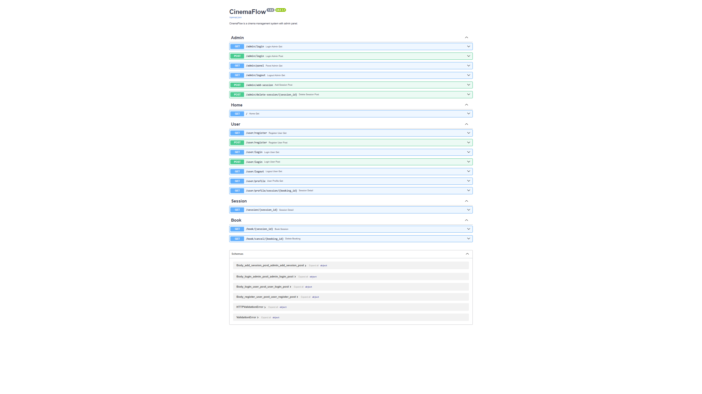
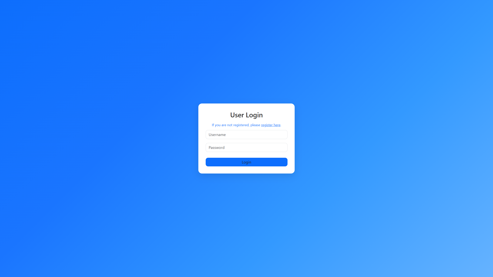
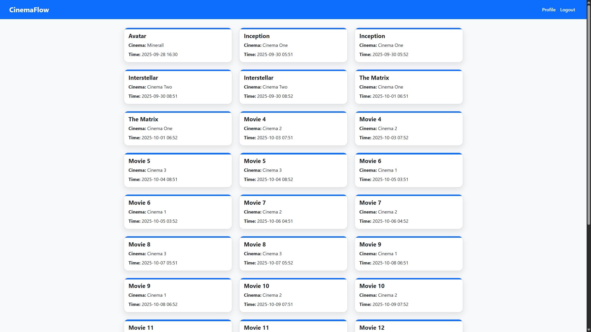
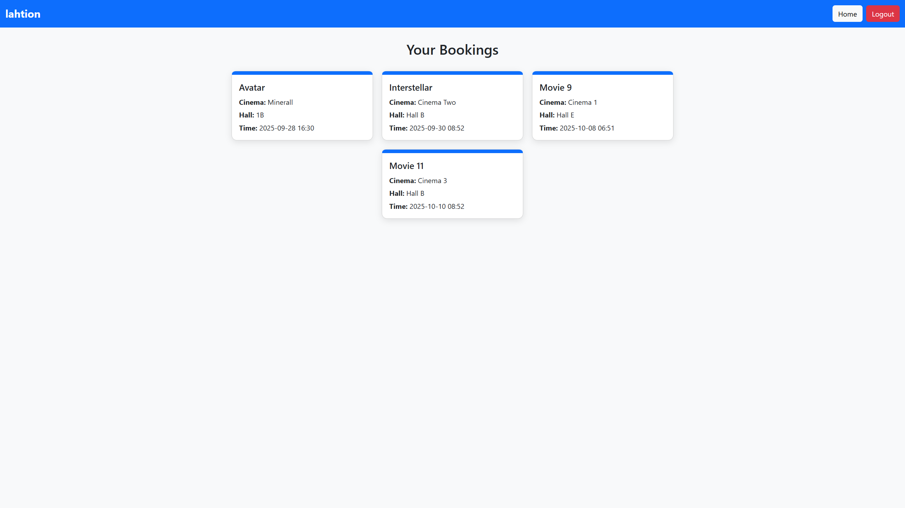
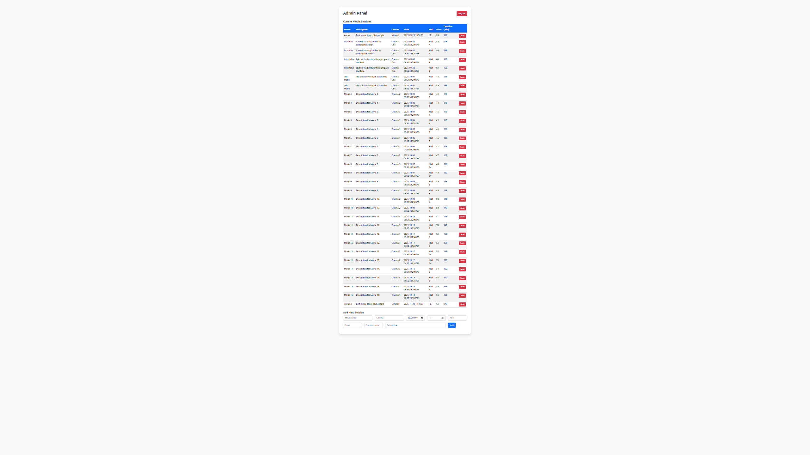

# 🎬 FastAPI CinemaFlow

FastAPI CinemaFlow — это полнофункциональное веб-приложение для онлайн-бронирования киносеансов, построенное с
использованием FastAPI, SQLAlchemy, SQLite и Jinja2 с Bootstrap для фронтенда.

<p align="left">
  
  
  
  
  
  
  
  
  
  
</p>

## 🚀 Возможности

- 🎬 Управление фильмами и сеансами
- 📅 Просмотр расписания киносеансов
- 🪑 Бронирование и отмена мест
- ✅ Аутентификация и авторизация через JWT
- 👤 Личный профиль пользователя с бронированиями
- 🎨 Адаптивный интерфейс на Bootstrap + Jinja2
- 🧾 Панель администратора для управления сеансами
- ⚡ Высокая скорость работы на Uvicorn + FastAPI

# 📸 Примеры работы

## 🧾Документация



### 🔐 Аутентификация



### 🔍 Общий вид




### 📦 Создание товара



## 🧰 Технологический стек

- **Язык:** Python 3.12+
- **Фреймворк:** FastAPI
- **Асинхронность:** asyncio
- **База данных:** SQLite (через SQLAlchemy ORM)
- **Схемы данных и валидация:** Pydantic v2
- **Аутентификация:** JWT
- **Хеширование паролей:** Passlib + Bcrypt
- **Фронтенд:** Jinja2 + Bootstrap 5
- **Документация:** OpenAPI (автоматически через Swagger UI)

## 📂 Структура проекта

```
.
|   .env
|   .env.template
|   .gitignore
|   database.db
|   README.md
|   requirements.txt
|
+---app
|   |   __init__.py
|   |   config.py
|   |   logger.py
|   |   main.py
|   |
|   +---database
|   |   |   __init__.py
|   |   |   models.py
|   |   |   session.py
|   |   |
|   |   +---cruds
|   |       |   __init__.py
|   |       |   booking_crud.py
|   |       |   movies_crud.py
|   |       |   users_crud.py
|   |
|   +---routers
|   |   |   __init__.py
|   |   |   admin_router.py
|   |   |   book_routers.py
|   |   |   home_router.py
|   |   |   session_routers.py
|   |   |   user_router.py
|   |
|   +---utils
|       |   __init__.py
|       |   check_valid.py
|       |   exception_handlers.py
|       |   schemas.py
|       |   security.py
|       |   token.py
|
+---images
|       admin_panel.png
|       booking.png
|       docs.png
|       home.png
|       login.png
|
\---templates
        admin_login.html
        admin_panel.html
        error.html
        home.html
        movie_detail_home.html
        movie_detail_profile.html
        profile.html
        user_login.html
        user_register.html
```

## 📦 Установка

1. Клонируйте репозиторий

```bash
git clone https://github.com/finniy/CinemaFlow.git
cd CinemaFlow
```

2. Создайте и активируйте виртуальное окружение

```bash
python -m venv venv
source venv/bin/activate  # Linux/macOS
venv\Scripts\activate     # Windows
```

3. Установите зависимости

```bash
pip install -r requirements.txt
```

5. Запустите бота

```bash
python main.py
```

## ⚙️ Переменные окружения

Файл `.env.template` для всех необходимых переменных.

---

## 📄 Лицензия

Проект распространяется под лицензией MIT. Свободно используй, дорабатывай и распространяй с указанием авторства.

---

## 👤 Автор

- GitHub: [@finniy](https://github.com/finniy)
- Telegram: [@fjnnjk](https://t.me/fjnnjk)

💌 Не забудьте поставить звезду ⭐ на GitHub, если вам понравился сайт! 😉